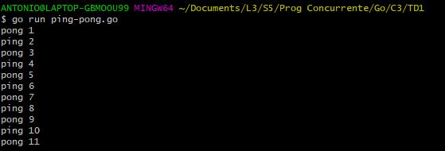

# Ping-Pong-with-Golang

Table tennis We want to simulate the data exchange (in this case a Ball object). 
between 2 routines (player function).

# How to complie 

you must have the Go compiler installed on your pc, download the fichiero ping-pong.go that is in the sources folder and run the command below.

